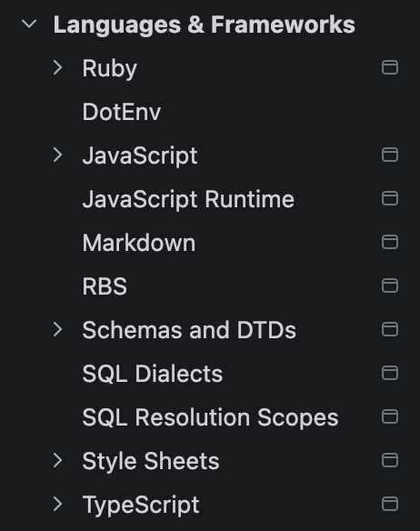
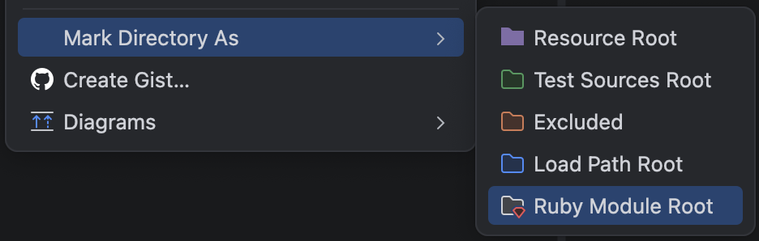
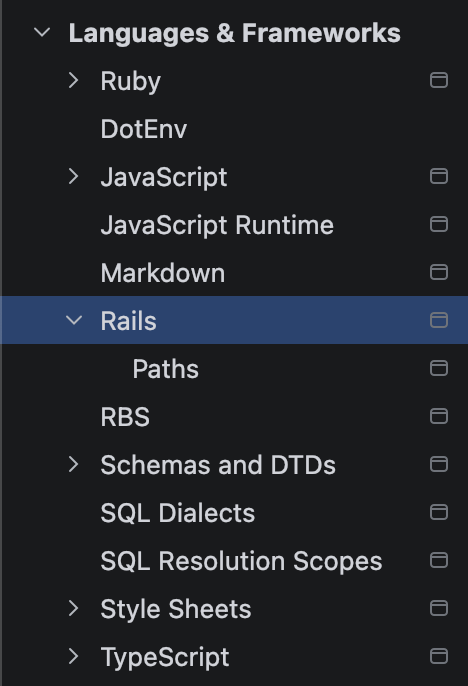
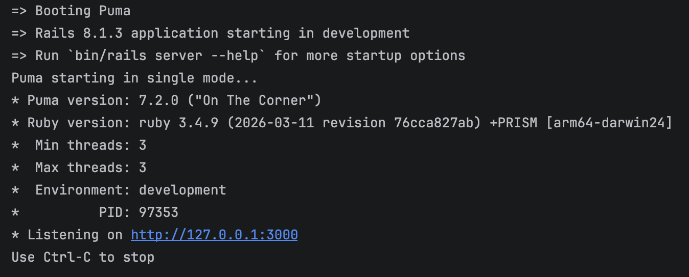
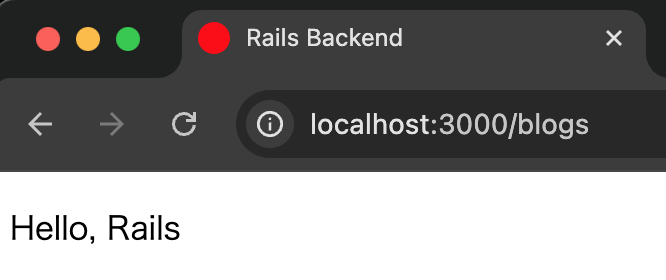

# rails_subdirectory_app

## Tested Environment

- Ruby 3.4.9
- Rails 8.1.3

## Setup for RubyMine

This Rails application is located under the `rails_backend` directory. To make RubyMine recognize it as a Rails project, mark `rails_backend` as a Ruby Module Root.

1. Open Settings/Preferences in RubyMine and check `Languages & Frameworks`. At first, Rails is not listed.

   

　  

2. In the Project view, right-click the `rails_backend` directory, then select `Mark Directory As` > `Ruby Module Root`.

   

　  

3. Open `Languages & Frameworks` in Settings/Preferences again. Rails is now listed.

   

　  

4. Start the Rails server from Run in RubyMine. When it starts successfully, the Rails server logs appear in the Run tool window.

   

　  

5. Open the Rails application in a browser and confirm that the page is displayed.

   
